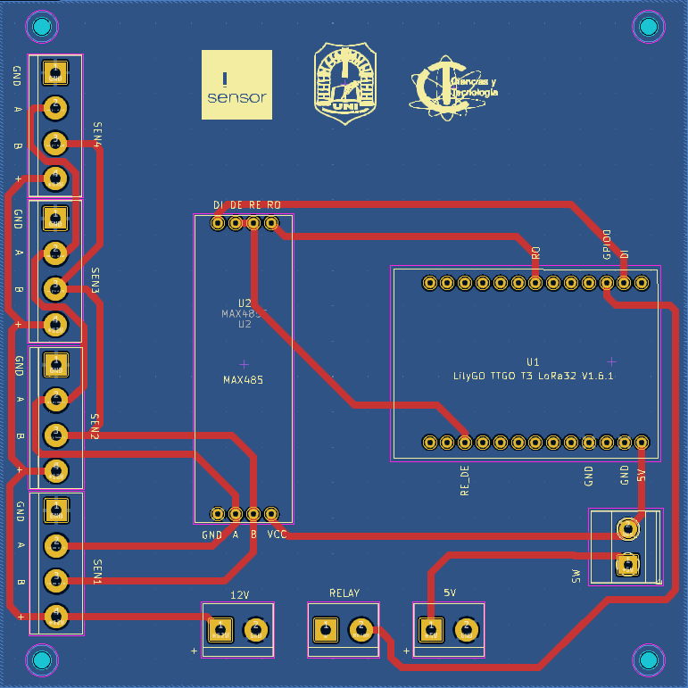

# Water-Quality Sensor Test PCB — Research Prototype (2024)

## Purpose

This PCB was designed as a hardware test platform for integrating and evaluating low-cost water-quality sensors within a 2024 university research project.

The broader research proposed a low-cost data-capture strategy for monitoring a tributary of the Paraná River in Encarnación, Paraguay.

## Validation status

The PCB was designed and used as part of the sensor-testing stage of the research project.

Specific test results, sensor calibration procedures, measurement datasets, firmware, and broader system-validation details are described only to the extent authorized by the project team and the related publication.

## My contribution

I designed the PCB used as a test platform for the water-quality sensors in this research project.

The board integrates:

- A LilyGO TTGO T3 LoRa32 development board interface.
- RS-485 communication support through a MAX485 transceiver.
- Terminal connections for multiple water-quality sensors.
- Power connections and auxiliary interfaces for prototype testing.

My contribution was focused on PCB design and hardware integration for sensor testing. I did not claim authorship of the complete monitoring strategy, firmware, data analysis, or all experimental validation activities.

## PCB layout

